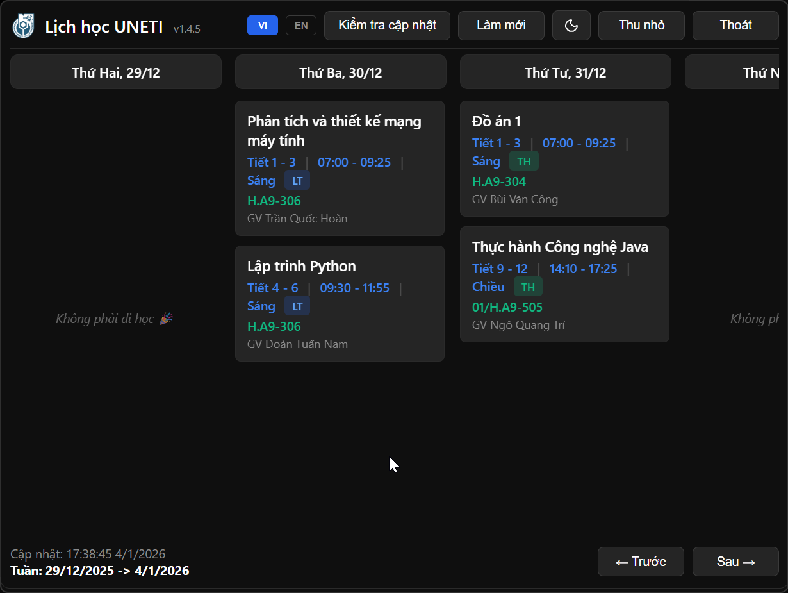
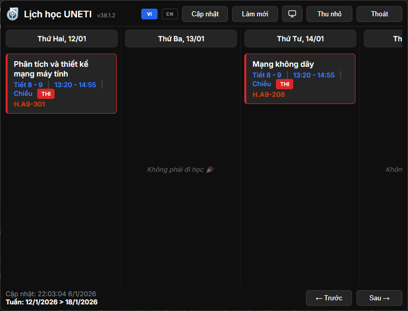
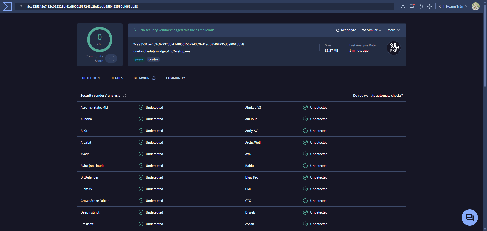

# UNETI Schedule Widget

A desktop app for UNETI students to check class schedules quickly and conveniently.

[](https://github.com/hoaug-tran/uneti-schedule-app)
[](https://github.com/hoaug-tran/uneti-schedule-app)

---

## Introduction

I built this app to make checking UNETI schedules easier. Instead of opening a browser and logging into the school's schedule page every time, you can just click the tray icon.

The app auto-refreshes schedules every hour, so your schedule is always up to date.

## Một số hình ảnh của Widget

<p align="center">
  
</p>
<p align="center"><em>Regular schedule</em></p>

<p align="center">
  
</p>
<p align="center"><em>Exam schedule</em></p>

## Main Features

- Display weekly class schedule
- Auto-refresh: current week every 1 hour, next week every 6 hours
- Works offline (uses cached schedule)
- Dark/Light theme
- Vietnamese/English
- Tray icon for quick access

## Installation

### Requirements

- Windows 10/11 (64-bit)
- About 150MB disk space

### How to Install

1. Download `.exe` file from [Releases](https://github.com/hoaug-tran/uneti-schedule-app/releases)
2. Run installer
3. Open app and login with UNETI account

> [!IMPORTANT]
> Internet required for first login. After that, app works offline.

## Notice and Disclaimer

> [!IMPORTANT]
> **DISCLAIMER**
>
> This project is an independent open-source initiative and is **NOT** affiliated with, endorsed by, or connected to **UNETI** (University of Economic and Technical Industries).
>
> The application functions by securely accessing the public student portal to retrieve schedule data for the authenticated user. Use this application at your own risk. The author(s) accept no responsibility for any errors, missed classes, or other issues resulting from the use of this software.

> [!CAUTION]
> **Regarding Virus/SmartScreen Warnings:**
> This app is NOT a virus. Because I don't have the budget ($300 - $600/year) to purchase a Microsoft Digital Certificate, Windows SmartScreen will flag this as an "Unknown Publisher."
> 
> **The app is 100% safe and open-source.** You can verify the code yourself in this repository.
>
> **To run the app:**
> 1. Click on **More info**.
> 2. Click **Run anyway**.
> 
> *Note: If your antivirus (Windows Defender, etc.) automatically deletes the file, you may need to temporarily disable it or add the app to the exclusion list.*

### VirusTotal result

<p align="center">
  
</p>

<p align="center">
  VirusTotal scan results at the time of release
  <a href="https://github.com/hoaug-tran/uneti-schedule-app/releases/tag/v1.5.1">
    v1.5.1
  </a>
  – 0/68 security engines detected malware.<br/>
  <a href="https://www.virustotal.com/gui/file/e212c1d26d1f09c380c4ac5d8219d75eb6f94c8f5daa0c362aab214b889023c1" target="_blank">
    View the detailed VirusTotal report
  </a>
</p>

## Usage

### Login

First time opening the app will show login window. Enter your UNETI username/password as usual.

> [!NOTE]
> App only stores encrypted session cookies on your computer, not your password.

### View Schedule

After login, schedule will auto-display. Use "← Previous" and "Next →" buttons to navigate weeks.

### Refresh Schedule

Click "Refresh" button to load latest schedule from server. You should refresh before important dates (exams, project deadlines...).

> [!TIP]
> App auto-refreshes every hour, but you should manually refresh before exam days to be sure.

### Tray Menu

Right-click tray icon to open menu:

- **Start with Windows**: Auto-run on computer startup
- **Clear Schedule Data**: Delete cached schedules (use when schedule is corrupted)
- **Clear User Data (Logout)**: Complete logout
- **View Logs**: View log file (for debugging errors)
- **Introduce**: View version, developer info
- **Auto Update**: Auto update when the app has a new version (enabled by default)
- **Exit**: Quit app

## FAQ

**Q: Is the app free?**  
A: Yes, completely free and open-source.

**Q: Does the app store passwords?**  
A: No. App only stores encrypted session cookies on your computer, not passwords.

**Q: Why do I need to login again?**  
A: UNETI cookies have expiration. When expired, you need to login again.

**Q: Is the schedule accurate?**  
A: Yes. App fetches schedule directly from UNETI server and auto-refreshes every hour.

**Q: Does the app work offline?**  
A: Yes. When offline, app uses cached schedule. When online again, it auto-updates.

**Q: Why is the app 150MB?**  
A: Electron runtime takes ~80MB (standard for Electron apps). App code is only ~5MB.

**Q: Where is data stored?**  
A: `%APPDATA%/uneti-schedule-widget/`. Cookies are encrypted using Windows Credential Manager.

## Troubleshooting

### Cannot Login

**Symptoms**: Click Login but login window doesn't open.

**Try these**:
1. Check internet connection
2. Temporarily disable firewall/antivirus
3. Restart app
4. Right-click tray → Clear User Data → Try again

### Incorrect or Missing Schedule

**Symptoms**: Schedule doesn't match UNETI website.

**Try these**:
1. Click "Refresh" button
2. If still wrong: Right-click tray → Clear Schedule Data
3. Check logs: Right-click tray → View Logs

### Week Navigation Redirects to Login

**Symptoms**: Clicking Previous/Next redirects to login screen.

**Cause**: Cookies expired.

**Solution**: Login again.

### "You are Offline" Notification Won't Disappear

**Symptoms**: Still shows offline notification despite having internet.

**Try these**:
1. Wait 5-10 seconds
2. Click "Refresh" button
3. Restart app
4. If still not working, try Right-click tray → Exit → Open app

### App does not update automatically / Update failed

**Issue description**:  
The application does not update to a newer version automatically, or the update process fails.

**Possible causes**:
- Unstable or interrupted network connection
- File write permissions blocked by antivirus software or Windows Defender
- Update files being removed during download
- An unexpected issue introduced by the developer (yes, this can happen)

**Solution**:
1. Fully exit the application
2. Visit the [Releases](https://github.com/hoaug-tran/uneti-schedule-app/releases) page
3. Download and install the **latest version**
4. Install it over the existing version (no need to uninstall first)

> [!NOTE]
> Installing a new version will **not remove your saved schedule data or login information**.  
> If the issue was caused by a bug on the developer side, I sincerely apologize and will fix it as soon as possible.

### App Doesn't Auto-Start

**Symptoms**: "Start with Windows" enabled but doesn't auto-start.

**Try these**:
1. Right-click tray → Disable "Start with Windows"
2. Wait 2 seconds
3. Right-click tray → Enable again
4. Restart computer to test

> [!WARNING]
> If you still encounter errors, please open an [issue](https://github.com/hoaug-tran/uneti-schedule-app/issues) on GitHub or contact me via email.

## Development

### Tech Stack

- Electron 33.2.1
- JavaScript (ES Modules)
- better-sqlite3 (database)
- Cheerio (HTML parser)
- Keytar (secure cookie storage)

### Setup

```bash
git clone https://github.com/hoaug-tran/uneti-schedule-app.git
cd uneti-schedule-app
npm install
npm run dev
```

### Build

```bash
npm run build
```

Build files will be in `dist/` folder.

## License

MIT License - see [LICENSE](LICENSE) file.

## Contact

**Trần Kính Hoàng (hoaug)**

- GitHub: [@hoaug-tran](https://github.com/hoaug-tran)
- Facebook: [hoaugtr](https://facebook.com/hoaugtr)
- Email: hi@trkhoang.com

---

Made with ❤️ by Trần Kính Hoàng - Student of the University of Economics - Technology for Industries (UNETI)
