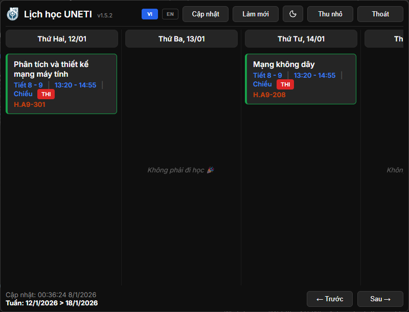

# Widget Lịch học UNETI

UNETI Schedule Widget là một ứng dụng desktop giúp sinh viên UNETI xem lịch học nhanh chóng và tiện lợi.


---

## Giới thiệu

Ứng dùng Widget này mình viết để theo dõi lịch học UNETI cho tiện. Thay vì phải mở trình duyệt, đăng nhập vào trang lịch của trường rồi thao tác nhiều bước mỗi lần muốn xem - và đôi khi website còn không truy cập được - thì giờ chỉ cần click vào tray icon là xong.

Ứng dụng hỗ trợ xem offline, nên ngay cả khi server trường gặp sự cố hoặc mất kết nối internet, bạn vẫn có thể xem lịch đã lưu.

Ứng dụng tự động làm mới lịch mỗi giờ để đảm bảo dữ lịch học, lịch thi luôn được cập nhật. Ngoài ra, bạn cũng có thể bấm Làm mới thủ công bất cứ lúc nào khi cần.

## Một số hình ảnh của Widget

<p align="center">
  
</p>
<p align="center"><i>Lịch học thường</i></p>

<p align="center">
  
</p>
<p align="center"><i>Lịch thi</i></p>

## Tính năng chính

- Hiển thị lịch học theo tuần
- Tự động làm mới: tuần hiện tại mỗi 1 giờ, tuần sau mỗi 6 giờ
- Hoạt động offline (dùng lịch đã lưu)
- Dark/Light theme
- Tiếng Việt/English
- Tray icon để truy cập nhanh
- Tự động kiểm tra cập nhật mỗi 6 giờ

## Cài đặt

### Yêu cầu

- Windows 10/11 (64-bit)
- Khoảng 150MB ổ cứng

### Cách cài

1. Tải file `.exe` từ [Releases](https://github.com/hoaug-tran/uneti-schedule-app/releases)
2. Chạy installer
3. Mở ứng dụng và đăng nhập bằng tài khoản UNETI

> [!IMPORTANT]
> Lần đầu cần internet để đăng nhập. Sau đó ứng dụng vẫn chạy được khi offline.

## Lưu ý & Từ chối trách nhiệm

> [!IMPORTANT]
> **TỪ CHỐI TRÁCH NHIỆM**
>
> Dự án này là một sáng kiến mã nguồn mở độc lập và **KHÔNG** trực thuộc, được ủy quyền hay liên kết với **Trường Đại học Kinh tế - Kỹ thuật Công nghiệp (UNETI)**.
>
> Ứng dụng hoạt động bằng cách truy cập cổng thông tin sinh viên public dưới danh nghĩa người dùng đã đăng nhập để tải dữ liệu lịch. Người dùng tự chịu trách nhiệm khi sử dụng. Tác giả không chịu trách nhiệm về bất kỳ lỗi hiển thị, lỡ lịch học/thi hay các vấn đề khác phát sinh từ việc sử dụng phần mềm.

> [!CAUTION]
> **Lưu ý về cảnh báo Virus / Windows SmartScreen:**
> Ứng dụng này KHÔNG chứa virus, malware, spyware hay bất kỳ mã độc nào. Do mình không có kinh phí (khoảng 5-7 triệu VNĐ/năm) để duy trì chứng chỉ xác thực từ Microsoft, nên Windows sẽ tự động gắn cờ đây là "Phần mềm không xác định" (Unknown Publisher).
> 
> **Ứng dụng sạch 100% và mã nguồn mở.** Bạn có thể tự mình kiểm tra code ngay tại repository này để yên tâm.
>
> **Để mở ứng dụng:**
> 1. Bấm vào **More info** (Thêm thông tin).
> 2. Chọn **Run anyway** (Vẫn chạy).
> 
> *Lưu ý quan trọng:* 
> - Nếu trình diệt virus (Windows Defender,...) tự động xóa file khi vừa tải về, bạn hãy tạm thời tắt diệt virus hoặc thêm file vào danh sách loại trừ (Exclusion list).

### Kết quả quét VirusTotal

<p align="center">
  
</p>

<p align="center">
  Kết quả quét VirusTotal tại thời điểm phát hành
  <a href="https://github.com/hoaug-tran/uneti-schedule-app/releases/tag/v1.5.2">
    v1.5.2
  </a>
  – 0/68 engine phát hiện mã độc<br/>
  <a href="https://www.virustotal.com/gui/file/9ca935345e7f32c072323bf41df0001567243c2bd1adb95f0423530ef061bb58" target="_blank">
    Xem chi tiết trên VirusTotal
  </a>
</p>

## Sử dụng

### Đăng nhập

Mở ứng dụng lần đầu sẽ hiện cửa sổ đăng nhập. Nhập tài khoản / mật khẩu trang sinh viên UNETI như bình thường.

> [!NOTE]
> Ứng dụng chỉ lưu cookie session được mã hóa tại máy của bạn, không lưu mật khẩu hay gửi đi đâu cả.

### Xem lịch

Sau khi đăng nhập, lịch sẽ tự động hiển thị. Dùng nút "← Trước" và "Sau →" để chuyển tuần.

### Làm mới lịch

Click nút "Làm mới" để tải lịch mới nhất từ server. Nên làm mới trước những ngày quan trọng (thi, nộp đồ án...).

> [!TIP]
> Ứng dụng tự động làm mới mỗi giờ, nhưng bạn vẫn nên bấm "Làm mới" thủ công trước ngày thi để chắc chắn.

### Tray Menu

Chuột phải vào tray icon để mở menu:

- **Khởi động cùng Windows**: Tự động chạy khi khởi động máy
- **Xoá dữ liệu lịch**: Xoá lịch đã lưu (dùng khi lịch bị lỗi)
- **Xoá dữ liệu người dùng (đăng xuất)**: Đăng xuất hoàn toàn
- **Xem nhật ký**: Xem file log (để debug khi có lỗi)
- **Giới thiệu**: Xem version của ứng dụng, thông tin của dev
- **Tự động cập nhật**: Tự động cập nhật khi có phiên bản mới (mặc định bật)
- **Thoát**: Thoát ứng dụng

## FAQ

**Q: Ứng dụng có miễn phí không?**  
A: Có, hoàn toàn miễn phí và open-source.

**Q: Ứng dụng có lưu mật khẩu không?**  
A: Không. Ứng dụng chỉ lưu cookie session được mã hóa tại máy của bạn, không lưu mật khẩu.

**Q: Tại sao nhiều khi phải đăng nhập lại?**  
A: Cookie của trường (UNETI) với mỗi tài khoản của sinh viên có thời hạn. Khi hết hạn thì phải đăng nhập lại.

**Q: Lịch có chính xác không?**  
A: Có. Ứng dụng lấy lịch trực tiếp từ server UNETI và tự động làm mới mỗi giờ.

**Q: Ứng dụng có hoạt động offline không?**  
A: Có. Khi mất mạng, ứng dụng sẽ dùng lịch đã lưu. Khi có mạng lại sẽ tự động cập nhật.

**Q: Tại sao khi cài ứng dụng nặng ~300MB?**  
A: Vì đây là ứng dụng Electron nên bộ cài phải chứa:
- Electron runtime (~200MB+)
- Native modules (keytar, better-sqlite3…)
- Tài nguyên giao diện
- Bộ cài NSIS và metadata

> Code JavaScript của ứng dụng thực tế chỉ ~5–10MB.  
> Dung lượng lớn là đặc điểm chung của ứng dụng Electron trên Windows, không phải riêng ứng dụng này.

**Q: Dữ liệu lưu ở đâu?**  
A: `%APPDATA%/uneti-schedule-widget/`. Cookie được mã hóa bằng Windows Credential Manager.

## Troubleshooting

### Không đăng nhập được

**Mô tả lỗi**: Click nút Đăng nhập nhưng không mở cửa sổ đăng nhập.

**Thử các cách sau**:
1. Kiểm tra kết nối internet
2. Tắt firewall/antivirus tạm thời
3. Tắt ứng dụng đi và mở lại
4. Chuột phải tray → Xoá dữ liệu người dùng → Thử lại

### Lịch bị sai hoặc thiếu

**Mô tả lỗi**: Lịch không khớp với trang web UNETI.

**Thử các cách sau**:
1. Click nút "Làm mới"
2. Nếu vẫn sai: Chuột phải tray → Xoá dữ liệu lịch → Thử lại
3. Kiểm tra log: Chuột phải tray → Xem file log (xem tên các buổi học có xuất hiện hay không)

### Chuyển tuần bị văng ra đăng nhập

**Mô tả lỗi**: Khi chuyển tuần click vào nút Trước/Sau bị chuyển hướng về màn hình đăng nhập.

**Nguyên nhân**: Cookie hết hạn.

**Giải pháp**: Đăng nhập lại.

### Thông báo "Bạn đang Offline" không biến mất

**Mô tả lỗi**: Dù đã có mạng nhưng vẫn hiện thông báo offline.

**Thử các cách sau**:
1. Đợi 5-10 giây
2. Click nút "Làm mới"
3. Khởi động lại ứng dụng
4. Nếu vẫn bị, chuột phải vào icon tray → Thoát → Mở lại ứng dụng

### Ứng dụng không tự cập nhật / không thể cập nhật

**Mô tả lỗi**: Ứng dụng không tự cập nhật phiên bản mới, hoặc đơn giản là không thể tự động cập nhật.

**Nguyên nhân có thể**:
- Kết nối mạng không ổn định
- Quyền ghi file bị chặn bởi antivirus / Windows Defender
- File update bị xóa trong quá trình tải
- Do thằng dev làm hỏng... (khả năng cao)

**Giải pháp**:
1. Thoát hoàn toàn ứng dụng
2. Truy cập trang [Releases](https://github.com/hoaug-tran/uneti-schedule-app/releases)
3. Tải và cài đặt **phiên bản mới nhất**
4. Ghi đè lên bản cũ (không cần gỡ cài đặt trước)

> [!NOTE]
> Việc cài đặt phiên bản mới sẽ **không làm mất dữ liệu lịch hoặc thông tin đăng nhập**.
> Nếu do dev thật, mình rất xin lỗi các bạn. Mình test kém quá.

### Ứng dụng không tự động khởi động

**Mô tả lỗi**: Dù đã bật "Khởi động cùng Windows" nhưng không tự khởi động.

**Thử các cách sau**:
1. Chuột phải vào tray icon → Tắt "Khởi động cùng Windows"
2. Đợi 2 giây
3. Chuột phải vào tray icon → Bật lại
4. Restart máy để test

> [!WARNING]
> Nếu vẫn gặp lỗi, vui lòng mở [issue](https://github.com/hoaug-tran/uneti-schedule-app/issues) trên GitHub hoặc liên hệ qua email.

## Development

### Công nghệ sử dụng

- Electron 33.2.1
- JavaScript (ES Modules)
- better-sqlite3 (database)
- Cheerio (HTML parser)
- Keytar (secure cookie storage)

### Setup

```bash
git clone https://github.com/hoaug-tran/uneti-schedule-app.git
cd uneti-schedule-app
npm install
npm run dev
```

### Build

```bash
npm run build
```

File build sẽ nằm trong folder `dist/`.

## License

MIT License - xem file [LICENSE](LICENSE).

## Liên hệ

**Trần Kính Hoàng (hoaug)**

- GitHub: [@hoaug-tran](https://github.com/hoaug-tran)
- Facebook: [hoaugtr](https://facebook.com/hoaugtr)
- Email: hi@trkhoang.com

---

Made with ❤️ by Trần Kính Hoàng - Sinh viên Trường Đại học Kinh tế - Kỹ thuật Công Nghiệp (UNETI).