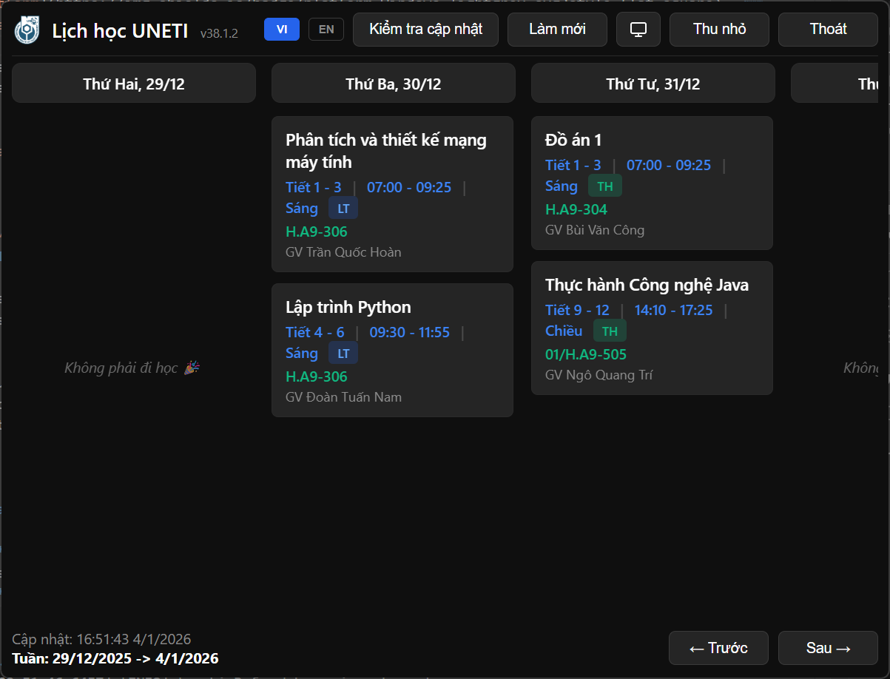

# UNETI Schedule Widget

Ứng dụng Widget Desktop hiện đại, hiệu năng cao giúp xem lịch học, lịch thi cho sinh viên **UNETI** (Đại học Kinh tế - Kỹ thuật Công nghiệp). Được xây dựng trên nền tảng **Electron**, tối ưu hóa cho sự ổn định, bảo mật và tiện dụng.

**[Read in English / Đọc bằng tiếng Anh](README.en.md)**

---

> [!IMPORTANT]
> **TỪ CHỐI TRÁCH NHIỆM**
>
> Dự án này là một sáng kiến mã nguồn mở độc lập và **KHÔNG** trực thuộc, được ủy quyền hay liên kết với **Trường Đại học Kinh tế - Kỹ thuật Công nghiệp (UNETI)**.
>
> Ứng dụng hoạt động bằng cách truy cập cổng thông tin sinh viên public dưới danh nghĩa người dùng đã đăng nhập để tải dữ liệu lịch. Người dùng tự chịu trách nhiệm khi sử dụng. Tác giả không chịu trách nhiệm về bất kỳ lỗi hiển thị, lỡ lịch học/thi hay các vấn đề khác phát sinh từ việc sử dụng phần mềm.

> [!CAUTION]
> **Lưu ý về cảnh báo Virus / Windows SmartScreen:**
> Ứng dụng này **KHÔNG PHẢI** là virus. Do mình không có kinh phí (khoảng 5-7 triệu VNĐ/năm) để duy trì chứng chỉ xác thực từ Microsoft, nên Windows sẽ tự động gắn cờ đây là "Phần mềm không xác định" (Unknown Publisher).
> 
> **App sạch 100% và mã nguồn mở.** Bạn có thể tự mình kiểm tra code ngay tại repository này để yên tâm.
>
> **Để mở ứng dụng:**
> 1. Bấm vào **More info** (Thêm thông tin).
> 2. Chọn **Run anyway** (Vẫn chạy).
> 
> *Lưu ý quan trọng:* > - Nếu trình diệt virus (Windows Defender,...) tự động xóa file khi vừa tải về, bạn hãy tạm thời tắt diệt virus hoặc thêm file vào danh sách loại trừ (Exclusion list).
> - Mình đã chủ động **gửi file lên Microsoft để phân tích mã độc (Malware Analysis)** nhằm đưa app vào "danh sách trắng", tuy nhiên quá trình duyệt của họ cần thời gian.

---

## Tính năng nổi bật

*   **Desktop Widget**: Widget luôn nổi (tùy chọn), ghim trên màn hình để xem nhanh.
*   **Lịch Thông Minh**: Tự động tải, phân tích và hiển thị lịch tuần hiện tại.
*   **Hỗ trợ Lịch Thi**: Giao diện và màu sắc riêng biệt cho lịch thi để dễ theo dõi.
*   **Bảo mật & Riêng tư**:
    *   **Context Isolation**: Bật mặc định để đảm bảo an toàn.
    *   **Lưu trữ An toàn**: Cookie/Mật khẩu được mã hóa cấp hệ điều hành không lo bị leak(Keytar).
    *   **Không theo dõi**: Không thu thập hay gửi dữ liệu cá nhân đi đâu. Để chắc chắn, vui lòng kiểm tra source code.
*   **Nhẹ & Mượt**: Tối ưu tài nguyên, chạy ngầm ít tốn RAM.
*   **Giao diện Động**: Chế độ Sáng/Tối/Tự động theo hệ thống.
*   **Đa ngôn ngữ**: Hỗ trợ Tiếng Việt và Tiếng Anh.
*   **Chế độ Offline**: Tự động lưu cache để xem lịch khi mất mạng.

## Cài đặt

1.  Truy cập trang **[Releases](https://github.com/hoaug-tran/uneti-schedule-app/releases)**.
2.  Tải file cài đặt mới nhất: `uneti-schedule-widget-x.x.x-setup.exe`.
3.  Chạy file cài đặt. Ứng dụng sẽ tự khởi động.
4.  Đăng nhập bằng **Tài khoản Sinh viên UNETI**.
5.  Xem lịch và đối chiếu qua với lịch trên web trường.

## Hướng dẫn sử dụng

*   **Điều hướng**: Dùng nút **Trước** / **Sau** để xem các tuần.
*   **Làm mới**: Bấm nút **Làm mới** để tải lại dữ liệu mới nhất từ trường.
*   **Cài đặt**: Bấm nút bánh răng để chỉnh Giao diện / Ngôn ngữ.
*   **Ẩn Widget**: Bấm nút **Thu nhỏ** hoặc phím `Esc` để ẩn xuống khay hệ thống hoặc đơn giản chỉ cần click ra bên ngoài.
*   **Thoát hẳn**: Chuột phải vào icon ở khay hệ thống (System Tray) -> `Exit`.
*   **Tự động khởi động**: Bật/tắt tùy chọn trong cài đặt để app khởi động cùng Windows bằng cách Chuột phải vào icon ở khay hệ thống (System Tray) -> `Khởi động cùng Windows / Start with Windows`.

## Khắc phục sự cố

### Lỗi "Phiên hết hạn" liên tục
Nếu bạn gặp thông báo này liên tục:
1.  Bấm **Đăng xuất** hoặc Khởi động lại ứng dụng.
2.  Đăng nhập lại để làm mới Cookie bảo mật.

### Lịch không cập nhật
*   Kiểm tra kết nối mạng.
*   App có cơ chế lưu Cache để xem offline. Hãy bấm **Làm mới** để ép tải lại dữ liệu.
*   Nếu cổng thông tin trường bảo trì, app sẽ hiện lịch sử cũ đã lưu.

### Không hiện Lịch Thi
App tự động phát hiện lịch thi. Nếu lịch thi hiện như lịch học thường:
1.  **Cập nhật** app lên bản mới nhất (thuật toán nhận diện có thể thay đổi ở các phiên bản hoặc bị hỏng do các thay đổi của trường).
2.  Tạo [issue](https://github.com/hoaug-tran/uneti-schedule-app/issues) trên GitHub report về lỗi kèm ảnh chụp lỗi và ảnh chụp màn hình lịch gốc trên web trường ( nếu lịch bị sai ).

## Công nghệ sử dụng

*   **Core**: Electron, Node.js
*   **Frontend**: HTML5, CSS3, JavaScript (ESM)
*   **Security**: Electron `contextBridge`, `keytar`
*   **Parser**: `cheerio`

## Giấy phép

Dự án được phát hành dưới giấy phép **MIT License**. Mã nguồn mở và miễn phí sử dụng. Xem file [LICENSE](LICENSE) để biết thêm chi tiết.

---

*Phần mềm này được tạo ra với mục đích giúp sinh viên UNETI quản lý thời gian học tập hiệu quả hơn.*
